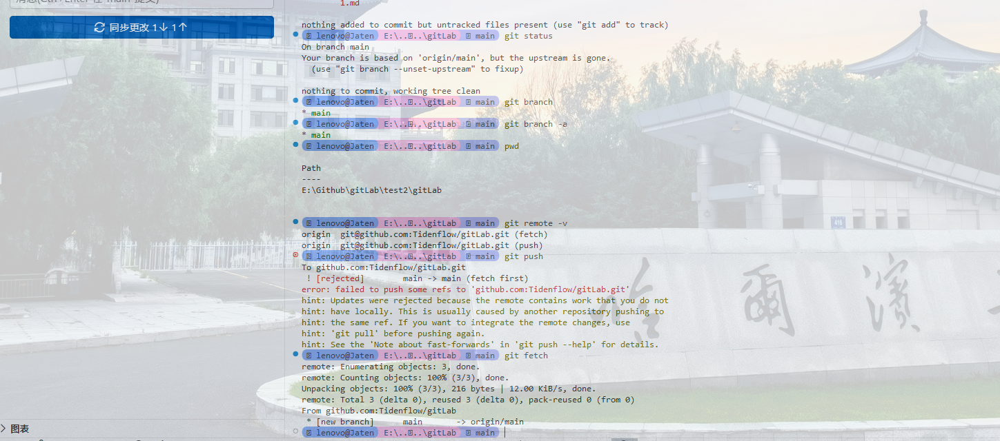

# 中国历史
## 河南省历史
### 洛阳市历史
#### 二里头
##### 夏都

**哈哈哈 粗体**
*哈哈哈  斜体*
~~哈哈哈 删除线~~
***哈哈哈 粗斜体***

- 香蕉
- 苹果
- 橘子

1. 打开编辑器
2. 编写文件
3. 保存推出

- 编程语言
  - Python
  - JavaScript
- 数据库
  - MySQL
- 操作系统
  - Linux
    

```C++
printf("Helloworld");
```


- 第一个
  - 第一


```bash
git clone 
```


```diff
- const debug = true
+ const debug = false
```


| 姓名 | 年龄 | 城市 |
| --- | ---: | :---: |
| 小明 | 18 | 北京 |
| 小红 | 20 | 上海 |

---

---

